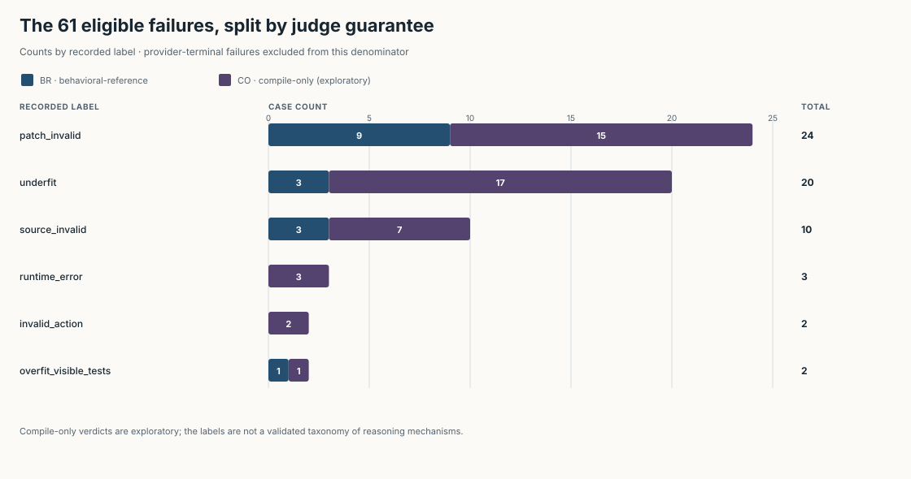



*by StrangeTcy*

<dl class="epistemic-status">
  <dt>Original ideas</dt>
  <dd>The central frame—that a binary result erases where the pipeline stopped—is an interpretation of this archive, not a new experiment.</dd>
  <dt>Synthesis</dt>
  <dd>This post reconciles the result checkpoint, terminal notes, judge-mode labels, campaign report, clean source comparator, and telemetry counters that do not agree.</dd>
  <dt>Prose</dt>
  <dd>Written by a language model in the Arena writing workflow from an audited evidence packet and an earlier draft. The writer and critique stages revised the same analysis; they added no campaign observations.</dd>
  <dt>Certainty</dt>
  <dd>High for archived counts, labels, and terminal notes. Medium for comparator-dependent claims because the archive records its repository as dirty. Low for claims about why a particular output occurred.</dd>
  <dt>Importance</dt>
  <dd>A row-level reporting method, not a general capability estimate: one model, one provider, one configuration, and one selected seed per case.</dd>
</dl>

Two rows in this archive carry the label `overfit_visible_tests`. It suggests a patch fitted the tests it could see rather than the task. Both rows also record a trusted score of 1.0. Both terminal notes say a required companion file is missing.

So the label points toward test gaming, the score toward a passing trusted check, and the note toward a missing artifact. Three fields on one row, pointing three ways.

That is more than a curiosity. If a row can carry a label its own note contradicts, aggregates built from those labels inherit the uncertainty. The place to fix it is the row. This post reads the rows.

## Who gets a row at all

The result checkpoint holds **194 scored cases: 131 PASS and 63 FAIL**. I am not going to edit that. Alongside it, the campaign records **24 omissions**: 17 `rope` cases dropped because the provider did not support their input modality, and 7 cases blocked before any provider call by known calibration failures. None of the 24 has a model score. Charging them to the model as failures would score tasks it never saw; crediting them as passes would be absurd in the other direction.

Then there is a disagreement inside the scored set. The campaign-level outage counter names one provider failure, but two final result files end with a terminal note attributing the failure to a provider transient after bounded retries. Which count do I believe? The archive does not settle it, so I carry all three:

| View | What is removed | PASS / FAIL | What the view represents |
|---|---|---|---|
| Raw checkpoint | nothing | 131 / 63 of 194 | every selected scored row, provider-terminal rows included |
| Report-consistent set | the one outage the report counter names | 131 / 62 of 193 | follows the campaign report's own count |
| Analysis set | both rows whose final notes blame the provider | 131 / 61 of 192 | follows the row-level terminal notes |

The 192-row set is my explicit exclusion, not a corrected campaign figure. The two excluded rows stay in the raw archive, scored, with their original labels. Everything below uses 192 unless I say otherwise.

One caveat applies to every sentence below about what a task asked or a judge checked. The archive records its repository as dirty. All 33 selected configuration hashes match a clean source comparator, but matching configs are not byte-level proof that the task, visible-test, judge, and helper code used in the paid run were clean. When I describe a judge, I am describing the comparator.

## Six labels are six places to stop

My first plan was to compute a model-attributable failure rate: take the 61 failures, remove the obviously infrastructural ones, divide the remainder by 192.

The plan was wrong, and the way it was wrong is the point.

The recorded labels point to different stages along a path: the provider has to return something; the agent has to emit a well-formed action carrying a non-empty patch; the patch has to pass source validation and run; and then a judge decides whether it is right. The scoreboard applies a projection $\pi : \textsf{Outcome} \to \{0, 1\}$ that forgets which stage produced the zero. Nothing downstream can recover the stage from the bit. Removing infrastructure still leaves several different kinds of failure, with different owners.

The diagram is a reading map for archived labels, not a measured trace of any one execution. It also keeps the two provider-terminal rows outside the 192-row analysis set and separates them from the two eligible `invalid_action` cases.

Here are the 61 failures in the 192-row set, with judge mode kept visible:

| Recorded label | Count | Behavioral-reference / compile-only | What the record supports |
|---|---:|---:|---|
| `patch_invalid` | 24 | 9 / 15 | every final note says the patch file is empty |
| `underfit` | 20 | 3 / 17 | a judge scored the submission below passing |
| `source_invalid` | 10 | 3 / 7 | syntax error or disallowed import, before execution |
| `runtime_error` | 3 | 0 / 3 | the patch executed and crashed |
| `invalid_action` | 2 | 0 / 2 | action rejected as malformed; see the next section |
| `overfit_visible_tests` | 2 | 1 / 1 | label contradicted by score and note; see the next section |

Compile-only verdicts are exploratory throughout; the campaign report excludes them from any validated aggregate. The split matters: the same failure label under different judge modes does not represent the same kind of evidence.

The stacked bars show these counts by judge guarantee. Bar width encodes a count, not a rate; the compile-only segment remains exploratory under the campaign report.

The `source_invalid` and `runtime_error` notes make the layering concrete: they range from validator rejection before execution to crashes after execution begins. The notes include disallowed imports, syntax problems, and a runtime tensor/boolean issue; some rows have no further detail.

These are not the same kind of event. A syntax error is plausibly the model's output being broken, and I will not strengthen that beyond “plausibly.” A rejected import is a collision between the output and a validator policy; whether that is the model's error depends on whether the policy was disclosed to the agent, and the archive does not tell me. An empty patch says nothing reached the validator, and the label does not tell me whether the agent emitted nothing or something was lost between the agent and the patch file. All of them enter the failure column.

Now the number that changed my mind about the plan. The behavioral-reference slice has 16 failures: nine empty patches, three source rejections, one mislabeled “overfit” row, and three `underfit` rows. Those last three are the slice’s only failures where a behavioral-reference judge evaluated a submitted patch and found it short.

So in the slice with the stronger guarantee, three of sixteen failures are the kind a behavioral test is designed to catch. The others stopped earlier. I am not saying the model is blameless for them; an empty patch may well be the agent’s doing. I am saying the labels do not let me assign it, so the honest move is to leave attribution open rather than default it to the model.

Seventeen of the twenty `underfit` rows are compile-only. Under compile-only scoring, “underfit” records a shortfall in a mode the report itself calls exploratory; under behavioral-reference scoring, it records a finding by the judge with the stronger guarantee. Same string, two different epistemic objects. More generally, `failure_mode` is a campaign/judge label, not a validated taxonomy of mechanisms. It says where a row stopped, not why.

## When the label and the note disagree

Back to the two rows I opened with.

| Environment | Judge mode | Recorded label | Score | Trusted score | Final note |
|---|---|---|---:|---:|---|
| [`batchnorm_ema`](https://github.com/StrangeTcy/rl_eval_generator/tree/d7357092493f311f649a0742889b301d796911b5/envs/batchnorm_ema) | compile-only | `overfit_visible_tests` | 0.95 | 1.0 | required file `train.py` missing |
| [`moco`](https://github.com/StrangeTcy/rl_eval_generator/tree/d7357092493f311f649a0742889b301d796911b5/envs/moco) | behavioral-reference | `overfit_visible_tests` | 0.95 | 1.0 | required file `moco_model.py` missing; note also says `temperature_cancelled` |

Whatever happened on these rows, the notes point to a packaging or contract failure, not overfitting. The label is the only evidence for overfitting, and it is contradicted by the rest of its own row. The record does not resolve whether the cause sits in the agent's output packaging, the judge's artifact requirements, or some interaction between them. These two rows are not straightforward evidence of overfitting.

The two provider-terminal rows are the mirror case. In the raw archive they carry the label `invalid_action`, which read naively suggests malformed model output. Their final notes say the terminal failure was a provider transient after bounded retries. I hold both facts: the raw label stays, and the note is why the rows sit outside the analysis denominator. What I will not do is describe them as ordinary model-format failures.

The other two `invalid_action` rows, inside the 61, are both compile-only and carry no such note. The same raw string appears in different evidentiary situations, and only the terminal note distinguishes them. A raw count of the label would merge events that the archive itself keeps apart.

## Two judges, two promises

The 192 rows were not graded under one contract. **72 are `behavioral_reference`: 56 PASS, 16 FAIL. 120 are `compile_only`: 75 PASS, 45 FAIL.** In the raw 194, the compile-only count is 122 at 75/47; both provider-terminal rows were compile-only.

So 131/192 is not an accuracy. It is a sum across two guarantees, and the campaign report says one of them is exploratory and excluded from any validated aggregate. The archive’s behavioral-reference subtotal is 56 of 72; even that is one selected seed per case across several environments, not a population estimate. A pass under compile-only scoring is not interchangeable with a pass under a behavioral-reference judge even when both are recorded as 1.

Why does the guarantee matter this much? Because a test only certifies what it executes. These are comparator observations; the dirty repository means they describe the clean snapshot, not the paid-run code with certainty. In the comparator, the [`compositional_optimizer`](https://github.com/StrangeTcy/rl_eval_generator/tree/d7357092493f311f649a0742889b301d796911b5/envs/cat_theo/compositional_optimizer) prompt promises nested associativity across multiple steps, while its judge checks tensor shape and a state-isolation chain. The [`sheaf_physical_constraints`](https://github.com/StrangeTcy/rl_eval_generator/tree/d7357092493f311f649a0742889b301d796911b5/envs/cat_theo/sheaf/sheaf_physical_constraints) judge enforces a 5:3 ratio the task never states. These examples do not show that every task is under-specified. They show that “the judge said FAIL” and “the task was failed” can come apart in both directions.

A related gap has been measured elsewhere. An [empirical study of SWE-bench Verified](https://dl.acm.org/doi/10.1145/3744916.3764576) reported that 7.8% of plausible patches counted as correct by benchmark validation failed the full developer-written test suite in that study. This is a result from its setting, not a rate for this campaign. I cite it as a separate example of how much a passing test contract can leave unchecked.

## A track label is a tag too

The same thing happens one level up. All seven [`epistemic_games`](https://github.com/StrangeTcy/rl_eval_generator/tree/d7357092493f311f649a0742889b301d796911b5/envs/epistemic_games) rows are recorded under the `ml_debugging` track. The dirty-source caveat applies to this semantic classification too: in the clean comparator, the task’s core is Bayesian inference over stipulated policy tables. That is a well-posed inference problem, but it is not ML debugging, and it is not recursive theory of mind.

The recorded track total stays as recorded: **`ml_debugging`, 37 cases, 16 PASS / 21 FAIL**. As an analysis view, not an edit to the archive, I separate it into the three ML-debugging environments at **9 / 30** and `epistemic_games` at **7 / 7**.

Even the 30 are not one thing. [`moco`](https://github.com/StrangeTcy/rl_eval_generator/tree/d7357092493f311f649a0742889b301d796911b5/envs/moco) is 9/11 under behavioral-reference judging, [`glyph`](https://github.com/StrangeTcy/rl_eval_generator/tree/d7357092493f311f649a0742889b301d796911b5/envs/glyph) is 0/8 under behavioral-reference, and [`batchnorm_ema`](https://github.com/StrangeTcy/rl_eval_generator/tree/d7357092493f311f649a0742889b301d796911b5/envs/batchnorm_ema) is 0/11 under compile-only. Each is one selected seed per case, and the judge modes differ. These are observations about this archive, not stable differences between tasks. The recorded 16/37 blends a perfect inference slice into a debugging slice whose environments span different outcomes under different judges. It describes none of them.

## Counters that will not reconcile

Underneath the results sits the run telemetry, and it does not agree with itself either. The archive has 268 run directories, including earlier and superseded attempts. Retry counts depend on where you look: 3,869 attempts in the selected final manifests, 6,412 in campaign progress, with the API logs and checkpoint rows disagreeing in between. The run configuration says `reasoning_enabled=false`, while usage logs report 325,785 reasoning tokens and 2,710 response rows containing a `reasoning_content` field.

The tempting inference is obvious: the flag was off, the tokens are there, so the model reasoned anyway. I decline it. A field’s presence is not its semantics, the cause of the disagreement is unknown, and no reasoning text is reproduced or examined here. What the archive establishes is a metadata discrepancy, full stop. There is also no spend field anywhere in the export, so the archive cannot support a cost estimate and I will not offer one.

## What a pass rate can still be

I do not think the scalar is useless. I think it has to come last.

A row that can answer “whose zero is it?” carries, at minimum: the raw verdict, any exclusion and its reason, the judge mode, whether a valid action and a non-empty patch existed, the validator outcome, the runtime outcome, and the judge’s terminal note, with missing required artifacts recorded separately from behavioral misses. Aggregate within documented judge modes before combining them. [HELM](https://arxiv.org/abs/2211.09110) made the broad case for many scenarios and metrics rather than one number; it is precedent, not validation of anything here. The specific layers have to fit the machine being measured.

What the archive licenses is a descriptive map. Outcomes vary by environment, from 2/8 eligible passes in trajectory synthesis to 31/33 in the recurrent-depth family, under judge guarantees that differ case by case and with no common calibration demonstrated across them. In the 192-row set, the 61 failures span six recorded labels. In the behavioral-reference slice, three of sixteen failures are `underfit`. Two “overfit” labels describe missing companion files beside trusted scores of 1.0. Two `invalid_action` rows have notes blaming the provider. One recorded track bundles an unrelated inference task.

**This benchmark does not establish a general capability ranking, a common difficulty scale, or a causal effect of any task axis.** It covers one model, one provider, one configuration, and one selected seed per case; the repository was recorded dirty, and the table combines two grading contracts, with compile-only exploratory throughout. Validator rejections, runtime crashes, packaging misses, judge-label mismatches, and provider outages are failures of different parts of the apparatus. The thing people want to measure is only one of those parts.

A pass rate can still go at the bottom of the page. It just has to be computed from rows that still carry their tags. In this archive the tags are where the answer lives, and for most of the zeros the answer is still open.
